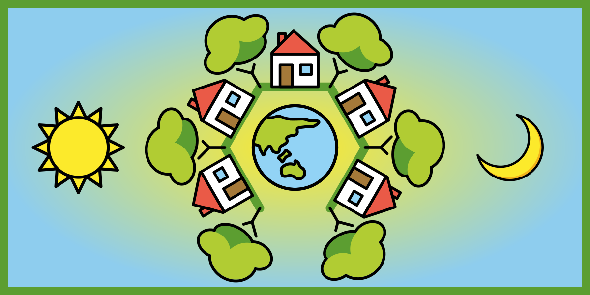
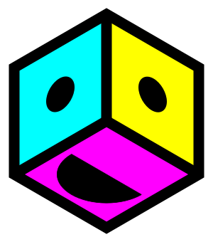
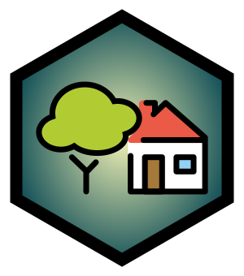
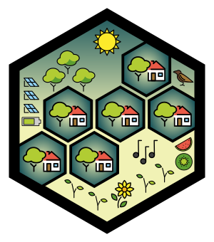

import { Box, Button, Flex, Grid, Text } from 'theme-ui'

<SEO title={'Kia Ora'} />

<Flex sx={{ flexDirection: 'column', alignItems: 'center', textAlign: 'center' }}>

<Box as='header' sx={{ padding: [3, null, 5, null, null] }}>

<Text
  sx={{
    fontSize: 3,
    textTransform: 'uppercase',
    color: 'secondary',
    fontWeight: 'bold',
  }}
>
  Our mission:
</Text>

<Text sx={{ fontSize: 6, color: 'primary' }}>
  To provide accessible building blocks for abundant living
</Text>

<Box 
  sx={{
    img: {
      padding: [2, null, 4, null, null],
      maxWidth: '100vw',
    },
  }}
>

</Box>

</Box>

<Box
  as='ol'
  sx={{
    paddingY: [2, null, 4, null, null],
    paddingLeft: 0,
    '& > li': {
      listStyle: 'none',
      display: 'flex',
      flexDirection: ['column', null, 'row', null, null],
      alignItems: 'center',
      justifyContent: ['center', null, 'space-between', null, null],
    },
    '& > li > p:nth-of-type(1)': {
      fontSize: 3,
    },
    '& > li > p:nth-of-type(2)': {
      marginLeft: [0, null, 4, null, null],
      alignSelf: ['center', null, 'flex-end', null, null],
    },
  }}
>

<Box as='li'>

From the small blocks inside your house:

</Box>

<Box as='li'>

To your house you live in:

</Box>

<Box as='li'>

To the village you live amongst:

</Box>

</Box>

<Box sx={{ fontSize: 4 }}>
  We want to enable you to be{' '}
  <Text sx={{ display: 'inline', color: 'accent' }}>
    creative and connected
  </Text>
  .
</Box>

<Button
  as="a"
  href="http://eepurl.com/g-4NVn"
  target="_blank"
  rel="noopener noreferrer"
  sx={{ fontSize: 7, margin: 5, backgroundColor: 'accent' }}
>
  Subscribe
</Button>

Learn more about us:

<Flex
  sx={{
    flexDirection: ['column', null, 'row', null, null],
    alignItems: ['center', null, 'baseline', null, null],
    '& > *': {
      padding: [2, null, 3, null, null],
    },
    '& > p': {
      display: ['none', null, 'inherit', null, null]
    }
  }}>

## [Principles](./principles)

:

## [Team](./team)

:

## [Roadmap](./roadmap)

:

## <a href="https://roamresearch.com/#/app/villagekit/page/X2c6rF5zE" target="_blank" rel="noopener noreferrer">Research</a>

</Flex>

</Flex>
