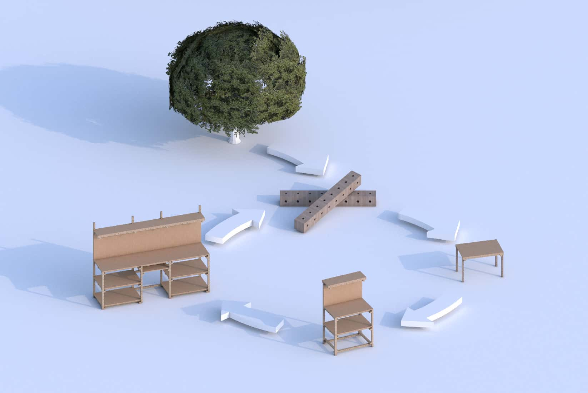

import { Box, Grid, Text } from 'theme-ui'

<SEO title={'Grid Kit'} />

# Grid Kit: Modular Furniture

- **Design** your own custom furniture and add to an open catalog
- **Make** custom furniture for yourself - with just a hex wrench
- **Buy** new and second-hand parts, with real-time prices from an open marketplace
- **Supply** customers using open production blueprints - enabled distributed production furniture within a truly circular economy

<Grid columns={2} sx={{ alignItems: 'center' }}>

</Grid>

<video
  controls
  poster="https://i.imgur.com/vi8MIph.jpg"
  preload="auto"
  muted="muted"
>
  <source type="video/mp4" src="https://i.imgur.com/p62seYr.mp4" />
</video>

## User stories

### With Status Quo

<Box sx={{ strong: { color: 'red.4' } }}>

&zwnj;<Text bg='yellow.4' color='black' sx={{ display: 'inline-block', paddingX: 2 }}>Alex and Jo</Text> are in Wellington and have a child on the way. Alex buys a crib from an online retailer. The kitset crib is sent to Alex and Jo from the **suppliers warehouse in Auckland**. The crib, certified to meet NZ standards, was made from **Indonesian plywood** and **shipped from India** to New Zealand.

After a few years their son, Charlie, has grown up and is in need of a larger bed. So they try to give away the old crib but it was **cheaply made** and broken by Charlie jumping up and down on it. It ends up **in the landfill**.

They buy a painted metal bunk bed to replace the crib, and have **trouble moving it** upstairs to Charlies room. The bunk bed is **made in China from Australian steel** and **shipped to New Zealand** by container.

When Charlie goes to university he leaves his bunk bed behind and buys the **cheapest furniture** he can find. It’s a bit akward and **doesn’t fit** his small room. When the year ends he leaves what he can’t take with him out on the footpath.

</Box>

### With Grid Kit

<Box sx={{ strong: { color: 'blue.4' } }}>

&zwnj;<Text bg='yellow.4' color='black' sx={{ display: 'inline-block', paddingX: 2 }}>Grant and Sarah</Text> are in Hamilton and have a child on the way. They order a Grid Kit crib kit from a **local supplier**. The design has been certified to meet NZ Standards. The crib is made from **local timber** and is shipped a **short distance to their house**.

When their daughter, Rose, is too large for the crib they **extend it with an expansion kit** and buy a **replacement part** for a broken beam.

When their next child is born they **use the app to design** a bunk bed exactly fitting Rose’s room. The parts they need are ordered from local supplier who has **recycled** parts in stock. Grant **shares the design** for others to use.

When Rose leaves for University her app tells her that she can make a single bed and a stand up desk from the parts in her bunk bed. She **dissasembles** the bunk and puts it in the back of her car. At the end of the year she takes the parts home and **reuses the parts** making an easel and a double bed.

</Box>

## Concept

**Grid Kit** starts with a modern adaptation of the open design system **Grid Beam** into a social enterprise.

> Grid Beam is a public domain modular construction system utilising a uniform grid, “stick” components and metal fasteners. It was invented in the late 1940’s by Ken Isaacs and has been developed and promoted by Phil and Richard Jergenson.
>
> _One unit of Grid Beam_ is a 40x40 cube with 8mm intersecting holes.
>
> 
>
> Learn more about Grid Beam at [gridbeam.xyz](https://gridbeam.xyz).
>
> 

Grid Kit continues the evolution with:

1. Software to explore, create and share Grid Beam designs.
2. Automated systems for production of beams from raw materials at volume.
3. Software to match suppliers with customer orders. Our focus is on timber beams and panels for the furniture market as we are aiming for economic viability.

Future expansions could include:

- Supplying aluminium and steel beams where there is a need for increased strength and durability.
- A marketplace for grid beam compatible 3rd party systems and accessories (lighting, fixtures, green-houses, gazebos, etc)
- Custom digitally fabricated components
