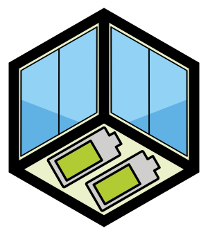
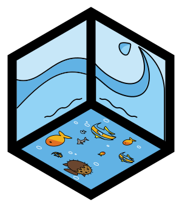

import { Flex } from 'theme-ui'

<SEO title={'Principles'} />

# Village Kit: Principles

The Village Kit provides open source protocols and turn-key solutions for modular living infrastructure.

We want to enable an ecosystem of reusable and interoperable building blocks to sustain life and evolve in community.

<Flex sx={{ justifyContent: 'flex-end' }}>

</Flex>

## Support the general movement with specific prototypes

As a trade-off with doing everything at once.

## Support well-engineered, interoperatble, and re-usable construction systems

As a trade-off with bespoke upcycling that is not modular, interoperable, or re-usable.

For example:

- [Grid Beam](https://gridbeam.xyz/)
- [structural pipe fittings](https://en.wikipedia.org/wiki/Structural_pipe_fitting)
- [T-Slot](https://en.wikipedia.org/wiki/T-slot_structural_framing)

<Flex sx={{ justifyContent: 'flex-end' }}>

</Flex>

## Use code-based [CAD](https://en.wikipedia.org/wiki/Computer-aided_design) where possible

For example:

- [OpenSCAD](http://www.openscad.org/)
- [OpenJSCAD](https://openjscad.org/)

## Enable open sharing of fractal (from macro to micro) designs

Such as a [package manager](https://en.wikipedia.org/wiki/Package_manager) (e.g. [`npm`](https://www.npmjs.com/)) for physcial modules

<Flex sx={{ justifyContent: 'flex-end' }}>

</Flex>

## Accumulating re-usable construction materials should be a viable economic savings strategy

## Use contrained plans and clear boundaries

As a trade-off with unconstrained macro-utopias (which continue to fail), we iterate with constrained pragmatic business plans and clear boundaries to support micro-utopias

For example:

- An #ecovillage requires too much upfront privilege, the whole system is dependent on self-actualizing visions, and there are unmitigated risk when conflicts inevitably arise
- The Burning Man org (and regional burn orgs) is actually authoritarian, but the authority is very limited in scope (e.g. where you are allowed to camp), which enables each camp to be their own anarchist micro-utopia
