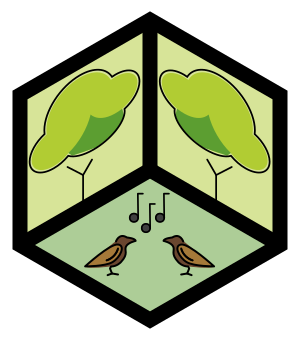

import { Flex } from 'theme-ui'

<SEO title={'Principles'} />

# Village Kit: Principles

The Village Kit is a system of systems.

We provide open source protocols and turn-key solutions for modular living infrastructure.

We want to enable an ecosystem of reusable and interoperable building blocks to sustain life and evolve in community.

<Flex sx={{ justifyContent: 'space-between' }}>

## Practical

</Flex>

### Support the general movement with specific prototypes

As a trade-off with doing everything at once.

### Use contrained plans and clear boundaries

As a trade-off with unconstrained macro-utopias (which continue to fail), we iterate with constrained pragmatic business plans and clear boundaries to support micro-utopias

For example:

- An #ecovillage requires too much upfront privilege, the whole system is dependent on self-actualizing visions, and there are unmitigated risk when conflicts inevitably arise
- The Burning Man org (and regional burn orgs) is actually authoritarian, but the authority is very limited in scope (e.g. where you are allowed to camp), which enables each camp to be their own anarchist micro-utopia

### Global design, local production

The internet allows us to connect from all around the world to solve the common problem of better living infrastructure.

Then anyone anywhere can download designs to create local products and employment.

The more who participate, the more use, the more designs, the more adaptation, the more ways to re-use, the more common systems for systems.

<Flex sx={{ justifyContent: 'space-between' }}>

## Sustainable

</Flex>

### Use non-toxic materials

We want to use materials that are found in nature and are friendly to the environment.

### Accumulating re-usable construction materials should be a viable economic savings strategy

Each modular component should be designed for dis-assembly, to be re-used again and again.

### Able to adjust your living spaces between situations and seasons

If you family visits for a time, you should be able to create a new space for them!

<Flex sx={{ justifyContent: 'space-between' }}>

## Technical

</Flex>

### Support well-engineered, interoperable, and re-usable construction systems

As a trade-off with bespoke upcycling that is not modular, interoperable, or re-usable.

For example:

- [Grid Beam](https://gridbeam.xyz/)
- [structural pipe fittings](https://en.wikipedia.org/wiki/Structural_pipe_fitting)
- [T-Slot](https://en.wikipedia.org/wiki/T-slot_structural_framing)

### Enable open sharing of fractal (from macro to micro) designs

Share your own personalized designs, from desk to bedroom to house to village.

Should be easy to publish and download: a [package manager](https://en.wikipedia.org/wiki/Package_manager) (e.g. [`npm`](https://www.npmjs.com/)) for physcial modules

### Use code-based [CAD](https://en.wikipedia.org/wiki/Computer-aided_design) where possible

For example:

- [OpenSCAD](http://www.openscad.org/)
- [OpenJSCAD](https://openjscad.org/)
