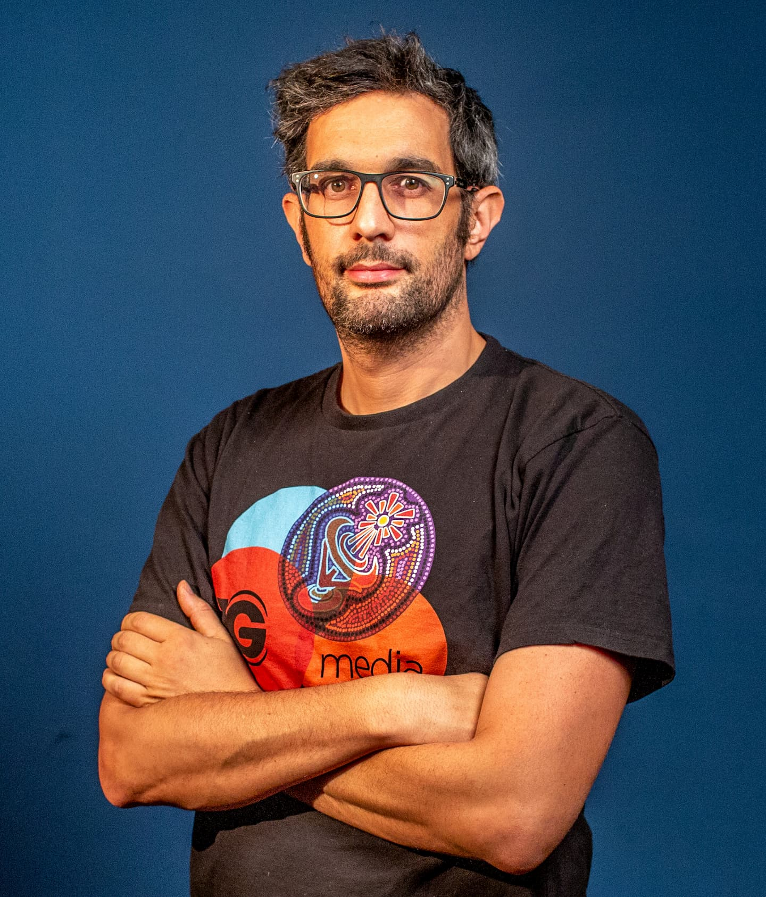
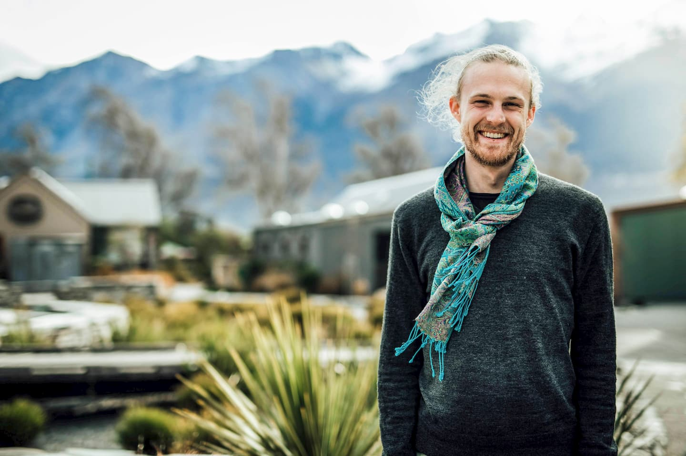

<SEO title="Team" />

# Village Kit: Team

## Rongomai Bailey

Rongomai is a jack-of-all-trades, working professionally in creative, mangement and technical roles.

Hard skills include animation, film and audio production, design, systems administration and general IT, project management and business management.

In 2019 he worked as General Manager of Ngaanyatjarra Media Aboriginal Corporation, a remote Australian first nations media organisation with over \$1M in revenue.

In 2020 he has the year off and will spend time on this project, programming his industrial 6-axis robotic arm to do japanese joinery and organising natural building workshops.

## Mikey Williams

[Mikey](https://dinosaur.is) is a social entrepreneur, senior web developer, and community facilitator based in Wellington.

Proficient in technical (software and hardware) systems, product development, system administration, leading a team to deliver business outcomes, documenting hard technical concepts in friendly language, and facilitating or- ganizations to solve challenging problems.

He’s part of the [Enspiral network](https://enspiral.com), works as part-time CTO of [Choice](https://choicetopay.com), is an [Edmund Hillary fellow](https://www.ehf.org/), contributes to [Scuttlebutt](https://scuttlebutt.nz), and is ready to focus on Village Kit from 2020 onward.
